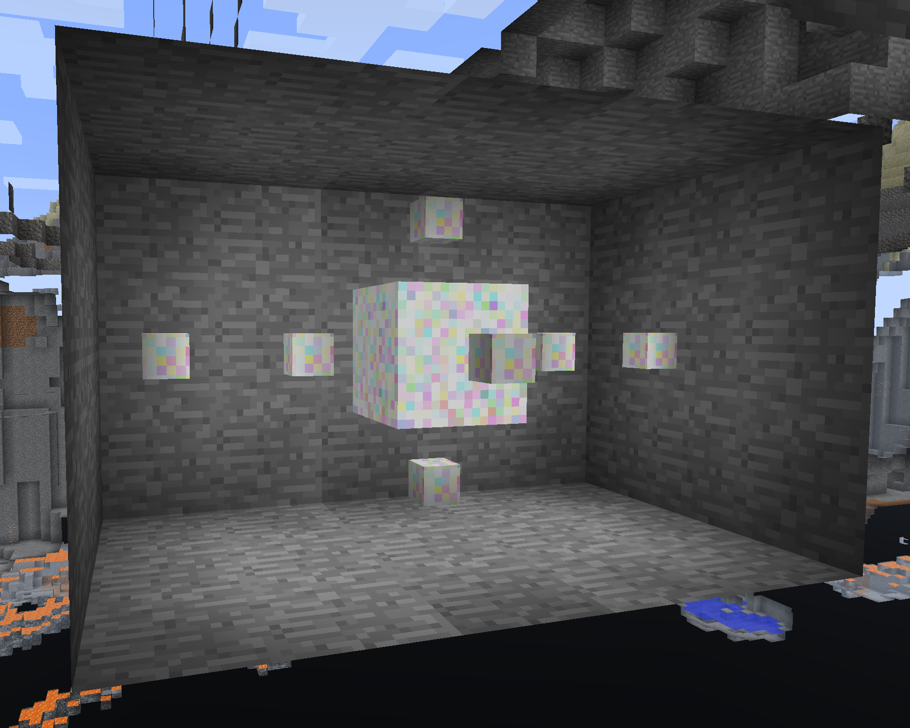
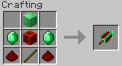
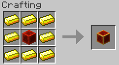
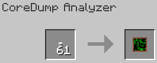
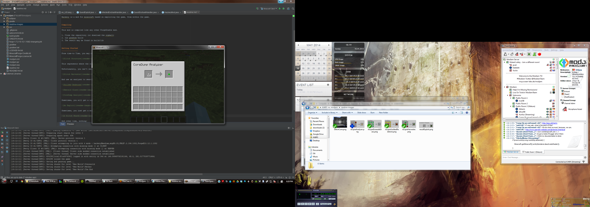
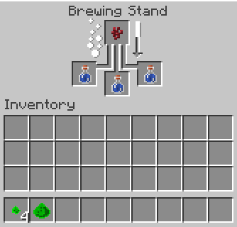

Hackery for Minecraft
=====================

About
-----

Hackery is a mod for minecraft based on exploiting the game, from within the game.
Requires Forge 1083!

Compiling
---------
This mod is compiled like any other ForgeGradle mod.

1. Clone the repository (or download the zipball)
2. run gradlew build
3. The result may be found in build/lib

Getting Started
---------------
From time-to Time, you may encounter structures like this in your world:

This represents where the code has failed, and has created the foothold for an exploit.

Unfortunately, you can't remove the glitch itself, but with the proper tool, you can collect some information about the crash.

And use an analyzer to search for possible exploits.

Sometimes, you will get a good exploit:

Sometimes, you just get a mess of code:

And other time, nothing!

There are a number of exploits available, but most of the only make sense on multiplayer servers.

Learning about them is half of the fun!

The shards are pretty pointless... maybe there is a use for them:

**WARNING: This mod contains fast-moving shaders, and may cause Epileptic fits, if you are prone to these, do NOT use this mod without turning the shaders off in the config**
